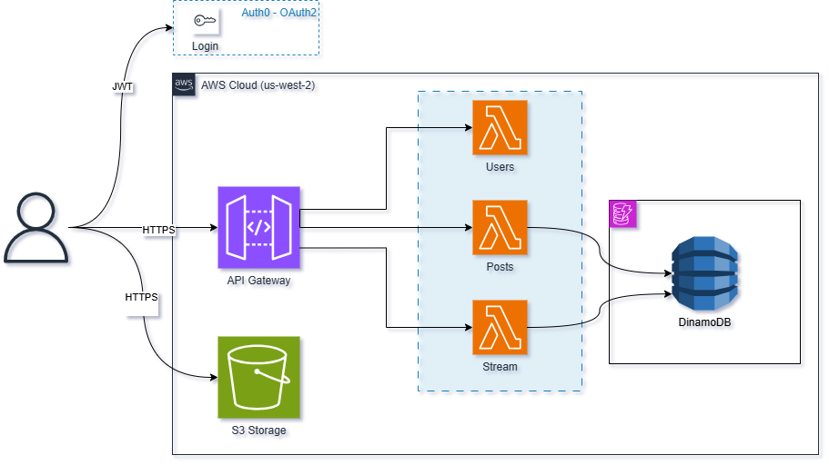
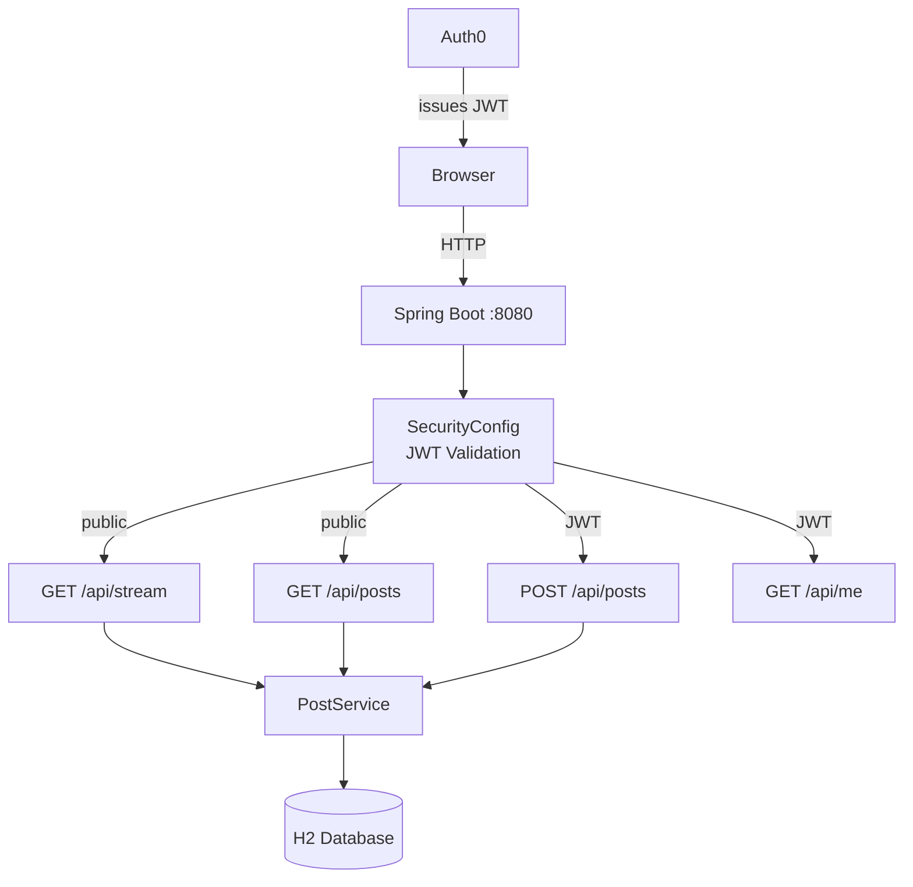
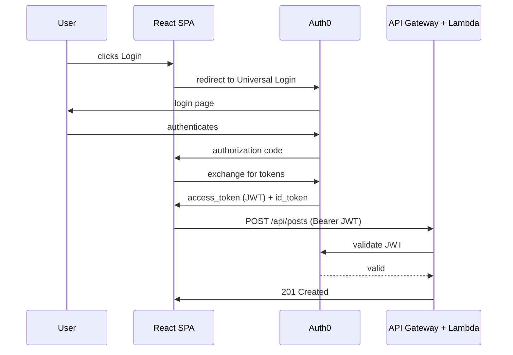

# AREP Twitter — Secure Microservices Application


## Description

AREP Twitter is a simplified Twitter-like application built as a university project for the AREP course at Escuela Colombiana de Ingeniería Julio Garavito. Users can create posts of up to 140 characters and view a public stream of all posts. Authentication is handled entirely by **Auth0** using OAuth2/OIDC — no sign-up forms, no passwords. Users log in through Auth0's Universal Login and receive a JWT that the backend validates on every protected request.



The project evolves through three phases:
1. **Monolith** — Spring Boot + H2 database (local development)
2. **Frontend SPA** — React + Vite + TypeScript with Auth0 integration
3. **Microservices on AWS** — Three Lambda functions behind API Gateway with DynamoDB, frontend hosted on S3

## Architecture

### Monolith (Local Development)



### Auth0 Authentication Flow



## Table of Contents

1. [Prerequisites](#prerequisites)
2. [Local Setup](#local-setup)
3. [Running Locally](#running-locally)
4. [AWS Deployment](#aws-deployment)
5. [Testing](#testing)
6. [Project Structure](#project-structure)
7. [Links](#links)
8. [Evaluation Rubric](#evaluation-rubric)
9. [Author](#author)

## Prerequisites

- Java 17 (OpenJDK or Oracle)
- Maven 3.9+
- Node.js 18+ with npm
- Auth0 tenant — configured at `onecode1.us.auth0.com`
- AWS account with permissions for Lambda, API Gateway, DynamoDB, and S3

## Local Setup

### 1. Clone and navigate

```bash
git clone <repo-url>
cd AREP-Microservices
```

### 2. Set environment variables

```bash
# Linux / macOS
export AUTH0_DOMAIN=onecode1.us.auth0.com
export AUTH0_AUDIENCE=https://onecode1.us.auth0.com/api/v2/

# Windows (Command Prompt)
set AUTH0_DOMAIN=onecode1.us.auth0.com
set AUTH0_AUDIENCE=https://onecode1.us.auth0.com/api/v2/

# Windows (PowerShell)
$env:AUTH0_DOMAIN="onecode1.us.auth0.com"
$env:AUTH0_AUDIENCE="https://onecode1.us.auth0.com/api/v2/"
```

> **Note:** The `monolith/src/main/resources/application.yml` already contains the hardcoded values for convenience. The environment variables above are only needed if you override the defaults.

### 3. Build monolith

```bash
cd monolith
mvn clean install
```

### 4. Install frontend dependencies

```bash
cd ../frontend
npm install
```

## Running Locally

### Start monolith (Spring Boot)

```bash
cd monolith
mvn spring-boot:run
# Backend runs on http://localhost:8080
# Swagger UI: http://localhost:8080/swagger-ui.html
# H2 Console: http://localhost:8080/h2-console
```

### Start frontend (React dev server)

```bash
cd frontend
npm run dev
# Frontend runs on http://localhost:5173
# API proxy: /api/* → http://localhost:8080
```

### Test API with curl

```bash
# Public endpoint — no token needed
curl http://localhost:8080/api/stream

# Get JWT from Auth0 (Machine-to-Machine test token)
# Then call protected endpoint:
curl -H "Authorization: Bearer <ACCESS_TOKEN>" http://localhost:8080/api/me

# Create a post (authenticated)
curl -X POST http://localhost:8080/api/posts \
  -H "Authorization: Bearer <ACCESS_TOKEN>" \
  -H "Content-Type: application/json" \
  -d '{"content": "Hello from curl!"}'
```

## AWS Deployment

### Deployment Status

All components are deployed and operational:

| Component | Service | Status |
|---|---|---|
| **Backend API** | API Gateway + 3 Lambda functions | ✅ Live |
| **Database** | DynamoDB (`arep-twitter-posts`) | ✅ Live |
| **Frontend** | S3 Static Website Hosting | ✅ Live |
| **Authentication** | Auth0 (OAuth2/OIDC) | ✅ Configured |

### Deployed Resources

- **API Gateway**: `https://xgoucasuwj.execute-api.us-west-2.amazonaws.com/prod`
- **Lambda Functions**:
  - `UserFunction` → `GET /api/me` (returns user profile from JWT)
  - `PostsFunction` → `POST /api/posts` (creates a post, stores in DynamoDB)
  - `StreamFunction` → `GET /api/stream`, `GET /api/posts` (reads all posts from DynamoDB)
- **DynamoDB Table**: `arep-twitter-posts` (on-demand billing, partition key: `id`, sort key: `createdAt`)
- **S3 Bucket**: `arep-twitter-frontend-sergiosilva` (static website hosting enabled)

### Auth0 Configuration

Application Client ID: `EWtdI5Fnwx8BkAEBHjseTmclhSwMObl4`

| Auth0 Setting | Values |
|---|---|
| **Allowed Callback URLs** | `http://localhost:5173`, S3 frontend URL |
| **Allowed Logout URLs** | `http://localhost:5173`, S3 frontend URL |
| **Allowed Web Origins** | `http://localhost:5173`, S3 frontend URL |
| **Allowed Origins (CORS)** | `http://localhost:5173`, S3 frontend URL |

## Testing

### Phase 1 (Monolith) — Automated Tests

```bash
cd monolith
mvn test
```

**Results: 6/6 tests pass**

| Test | Description | Result |
|------|-------------|--------|
| `shouldReturnStreamWithoutAuth` | `GET /api/stream` returns 200 without JWT | PASS |
| `shouldRejectPostWithoutJwt` | `POST /api/posts` without Authorization returns 401 | PASS |
| `shouldRejectPostOver140Chars` | `POST /api/posts` with 141-char content returns 400 | PASS |
| `shouldCreatePostWithValidJwt` | `POST /api/posts` with mock JWT returns 201 + post body | PASS |
| `shouldReturnUserInfoWithJwt` | `GET /api/me` with mock JWT returns sub/email/name | PASS |
| `postServiceCreatesPost` | Unit test: `PostService.createPost()` sets correct fields | PASS |

### Phase 2 (Frontend) — Manual Testing Checklist

Start both `mvn spring-boot:run` (port 8080) and `npm run dev` (port 5173), then:

1. Open `http://localhost:5173` — dark theme, navbar with Login button visible
2. Click **Login** → redirects to Auth0 Universal Login
3. Authenticate → returns to `http://localhost:5173` with user profile shown
4. Create a post (≤140 chars) → character counter shows green → click **Post** → post appears in stream
5. Type 141+ chars → counter turns red → **Post** button disabled
6. Click **Refresh** on stream → posts reload
7. Click **Logout** → Auth0 logout → redirected to origin, Login button restored
8. Try to POST without being logged in → 401 returned, error toast shown

### Phase 3 (Lambda) — Compile Verification

```bash
# All three compile successfully:
ls microservices/user-function/target/user-function-0.0.1-SNAPSHOT.jar    # exists
ls microservices/posts-function/target/posts-function-0.0.1-SNAPSHOT.jar  # exists
ls microservices/stream-function/target/stream-function-0.0.1-SNAPSHOT.jar # exists
```

### Phase 3 (Lambda) — Optional Local Testing

```bash
cd infrastructure
sam local start-api
# Simulates API Gateway + Lambda locally
# Endpoints available at http://localhost:3000/api/...
```

## Project Structure

```
AREP-Microservices/
├── monolith/                              # Phase 1: Spring Boot (H2 + Auth0)
│   ├── src/
│   │   ├── main/
│   │   │   ├── java/edu/eci/arep/twitter/
│   │   │   │   ├── TwitterApplication.java
│   │   │   │   ├── config/
│   │   │   │   │   ├── SecurityConfig.java
│   │   │   │   │   ├── AudienceValidator.java
│   │   │   │   │   ├── CorsConfig.java
│   │   │   │   │   └── OpenApiConfig.java
│   │   │   │   ├── controller/
│   │   │   │   │   ├── PostController.java
│   │   │   │   │   ├── StreamController.java
│   │   │   │   │   └── UserController.java
│   │   │   │   ├── dto/
│   │   │   │   │   ├── CreatePostRequest.java
│   │   │   │   │   └── ErrorResponse.java
│   │   │   │   ├── model/
│   │   │   │   │   └── Post.java
│   │   │   │   ├── repository/
│   │   │   │   │   └── PostRepository.java
│   │   │   │   └── service/
│   │   │   │       └── PostService.java
│   │   │   └── resources/
│   │   │       └── application.yml
│   │   └── test/
│   │       └── java/edu/eci/arep/twitter/
│   │           └── PostControllerTest.java
│   └── pom.xml
├── frontend/                              # Phase 2: React + Vite + TypeScript
│   ├── src/
│   │   ├── components/
│   │   │   ├── Navbar.tsx
│   │   │   ├── LoginButton.tsx
│   │   │   ├── LogoutButton.tsx
│   │   │   ├── PostForm.tsx
│   │   │   ├── StreamFeed.tsx
│   │   │   └── UserProfile.tsx
│   │   ├── hooks/
│   │   │   └── useApi.ts
│   │   ├── App.tsx
│   │   ├── main.tsx
│   │   └── index.css
│   ├── index.html
│   ├── package.json
│   ├── tsconfig.json
│   └── vite.config.ts
├── microservices/                         # Phase 3: AWS Lambda handlers
│   ├── user-function/
│   │   ├── src/main/java/edu/eci/arep/twitter/lambda/
│   │   │   └── UserHandler.java
│   │   └── pom.xml
│   ├── posts-function/
│   │   ├── src/main/java/edu/eci/arep/twitter/lambda/
│   │   │   └── PostsHandler.java
│   │   └── pom.xml
│   └── stream-function/
│       ├── src/main/java/edu/eci/arep/twitter/lambda/
│       │   └── StreamHandler.java
│       └── pom.xml
├── infrastructure/
│   └── template.yaml                      # SAM IaC (Lambda + API GW + DynamoDB)
├── README.md
└── .gitignore
```

## Links

| Component | URL |
|---|---|
| **Frontend (S3)** | https://arep-twitter-frontend-sergiosilva.s3.us-west-2.amazonaws.com/index.html |
| **Backend API (API Gateway)** | https://xgoucasuwj.execute-api.us-west-2.amazonaws.com/prod |
| **Public Stream (no auth)** | https://xgoucasuwj.execute-api.us-west-2.amazonaws.com/prod/api/stream |
| **Auth0 Tenant** | https://onecode1.us.auth0.com |
| **Swagger UI (local only)** | http://localhost:8080/swagger-ui.html |

## Video Demo

*(Optional: +5% bonus)*

Record a 5-8 minute walkthrough demonstrating:
1. Frontend login via Auth0
2. Create a post (≤140 characters)
3. View post in the stream
4. Logout from Auth0
5. Show Swagger UI at http://localhost:8080/swagger-ui.html
6. Show AWS Console (Lambda, DynamoDB, API Gateway)

**Demo Script Available:** See [guion.md](guion.md) for a 5-minute presentation script.
- Complete walkthrough with screen capture timing
- Covers: E2E flow, Swagger, Diagrams, Auth0 OAuth, Testing, Architecture
- Ready for recording with transitions and notes

Upload video link here: [Video demo link]

---

## Evaluation Rubric

<details>
<summary><b>Click to expand rubric</b></summary>

### Functional Requirements (50%)

- [x] **Monolith (Spring Boot + Auth0)** — 15% ✅
  - [x] Spring Boot 3.3, Java 17, H2 file-based database
  - [x] Auth0 JWT validation (audience `https://onecode1.us.auth0.com/api/v2/` + issuer `https://onecode1.us.auth0.com/`)
  - [x] `GET /api/stream` — public, returns all posts newest-first
  - [x] `GET /api/posts` — public, same as stream
  - [x] `POST /api/posts` — authenticated, validates ≤140 chars, extracts sub+name from JWT, returns 201
  - [x] `GET /api/me` — authenticated, returns `{ sub, email, name }` from JWT claims
  - [x] Swagger UI at `/swagger-ui.html` with Bearer JWT security scheme
  - [x] 6/6 automated tests passing ✅

- [x] **Frontend (React SPA)** — 15% ✅
  - [x] React 18 + Vite 5 + TypeScript (strict, no `any`)
  - [x] Auth0 login/logout via `@auth0/auth0-react`
  - [x] `useApi.ts` hook: `fetchWithAuth` (Bearer token) + `fetchPublic` (no token)
  - [x] `PostForm`: textarea, green/red 140-char counter, error toast, disabled button when over limit
  - [x] `StreamFeed`: public stream, refresh button, fadeIn animation on post cards
  - [x] `UserProfile`: shows name and email from `/api/me`
  - [x] `isLoading` guard in `App.tsx` (no render before auth resolves)
  - [x] Single `index.css` with CSS custom properties, dark theme
  - [x] `npm run build` succeeds with zero TypeScript errors

- [x] **Microservices (Lambda)** — 15% ✅
  - [x] `UserHandler`: extracts `sub`, `email`, `name` from API Gateway JWT authorizer context
  - [x] `PostsHandler`: parses JSON body, validates ≤140 chars, generates UUID, writes to DynamoDB, returns 201
  - [x] `StreamHandler`: scans DynamoDB, sorts by `createdAt` DESC, returns JSON array
  - [x] DynamoDB item schema: `id` (S), `createdAt` (S), `content` (S), `authorSub` (S), `authorName` (S)
  - [x] `POSTS_TABLE` from `System.getenv()` — no hardcoded table name
  - [x] AWS SDK v2 (`software.amazon.awssdk`) — not v1
  - [x] All 3 handlers compile: `mvn clean package` produces fat JAR ✅

- [x] **Deployment (AWS)** — 5% ✅
  - [x] CloudFormation stack `arep-twitter` deployed in `us-west-2`
  - [x] DynamoDB table `arep-twitter-posts` created with on-demand billing
  - [x] API Gateway routes `/api/me`, `/api/posts`, `/api/stream` to correct Lambda handlers
  - [x] Frontend `dist/` hosted on S3 with static website hosting enabled
  - [x] Auth0 configured with S3 frontend URL for callbacks and CORS

### Non-Functional Requirements (30%)

- [x] **Security** — 10% ✅
  - [x] Auth0 JWT validated on every protected request (audience + issuer assertions)
  - [x] CORS restricted to `http://localhost:5173` and `http://localhost:3000` on monolith
  - [x] No secrets hardcoded in source code (only `application.yml` config and `.env`)
  - [x] `.gitignore` excludes `target/`, `node_modules/`, `.env`, `*.pem`, `*.key`
  - [x] Post content validated at ≤140 chars on both frontend and backend
  - [x] Auth0 handles all authentication — no custom login/password, no `User` table

- [x] **Code Quality** — 10% ✅
  - [x] TypeScript: no `any` types, all API responses typed with interfaces
  - [x] Java: `@Valid` + `@Size(max=140)` on `CreatePostRequest`, `ErrorResponse` DTO for exceptions
  - [x] No `@CrossOrigin` on controllers — global `CorsConfig` only
  - [x] `PostService` encapsulates business logic (not in controller)
  - [x] Each Lambda handler catches exceptions and returns structured JSON error response

- [x] **Documentation** — 10% ✅
  - [x] README with 4 Mermaid architecture diagrams (monolith, frontend, microservices, Auth0 sequence)
  - [x] Step-by-step local setup and run instructions
  - [x] Step-by-step AWS deployment guide (Lambda via SAM, frontend via S3)
  - [x] Test report: Phase 1 6/6 tests listed with descriptions, Phase 2 manual checklist
  - [x] Links section: Swagger UI, API Gateway endpoint, S3 frontend URL, Auth0 tenant (updated with deployment status)
  - [ ] Video demo (optional)

### Bonus (up to +20%)

- [ ] **Video demo** — 5-8 min walkthrough: login → post → stream → logout → AWS Console evidence (+5%)
- [ ] **Docker Compose** for local monolith + DynamoDB local (no AWS needed) (+5%)
- [ ] **Additional test coverage** (StreamController, PostService unit tests) (+5%)
- [ ] **API versioning** (e.g., `/api/v1/posts`) (+3%)
- [ ] **Rate limiting** or structured request logging (+2%)

### Grading Scale

| Score | Criteria |
|-------|----------|
| 90–100 | All functional + non-functional requirements met, clean code, complete documentation |
| 80–89 | All functional requirements met, minor gaps in documentation or code quality |
| 70–79 | Monolith + Frontend working, Lambda deployable but not live-tested |
| 60–69 | Monolith working, Frontend incomplete or buggy |
| <60 | Incomplete submission or critical failures |

</details>

## Author

**Sergio Andrey Silva Rodriguez**
Escuela Colombiana de Ingeniería Julio Garavito — AREP 2026

## License

MIT
